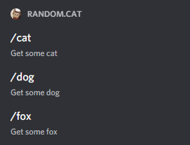
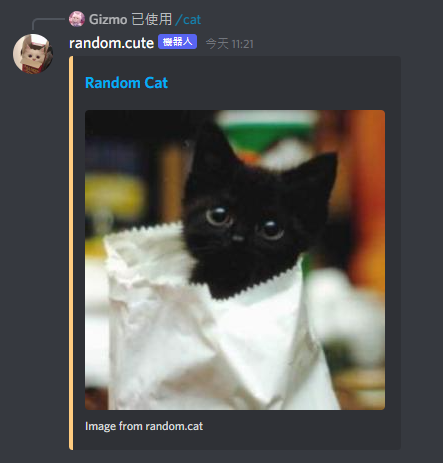

# Random Cute Bot

一个纯粹的 Discord 机器人, 可以使用 [斜线命令](https://discord.com/developers/docs/interactions/application-commands) 获取可爱的图片.

## How to use

### 使用 Deno Deploy

点击下方的按钮即可部署.

### 使用 Vercel

coming soon

## Thanks

Thanks to [JetBrains](https://jb.gg/OpenSource) for the open source license(s).

## License

Code is distributed under [MIT](./LICENSE) license, feel free to use it in your proprietary projects as well.
